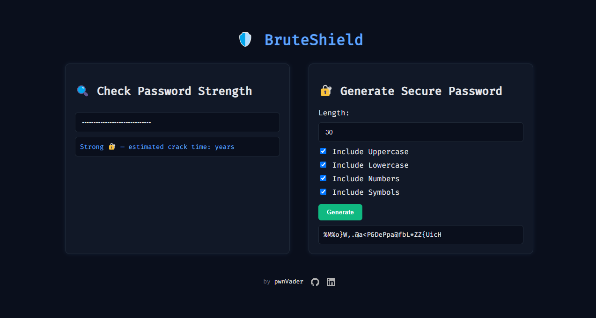

# BruteShield - Password Tool 🛡️

BruteShield is a **powerful** and **simple** web tool for **checking password strength** and **generating secure passwords**. It allows users to check how strong a password is and estimates how long it would take for an attacker to crack it. Additionally, BruteShield features a **secure password generator** with customizable options like length, character types (uppercase, lowercase, numbers, symbols), and more!

---

## 🚀 Features

- **Check Password Strength**: 
  - Analyze any password's strength and see an estimate of how long it would take for an attacker to crack it.

- **Generate Secure Password**: 
  - Create random, secure passwords with customizable options. You can control the **length** of the password and **select the character types**: uppercase, lowercase, numbers, and symbols.

---

## 📸 Demo

---

## 📘 How to Use

1. **Check Password Strength**:
   - Type or paste a password into the **"Enter your password..."** field.
   - The tool will **immediately analyze** the strength of the password and show an estimated crack time.

2. **Generate Secure Password**:
   - Select the **desired length** (from 4 to 100 characters).
   - Choose the **character types** you want to include (uppercase, lowercase, numbers, symbols).
   - Click **Generate**, and a strong password will be displayed.

---

## ⚙️ Use

